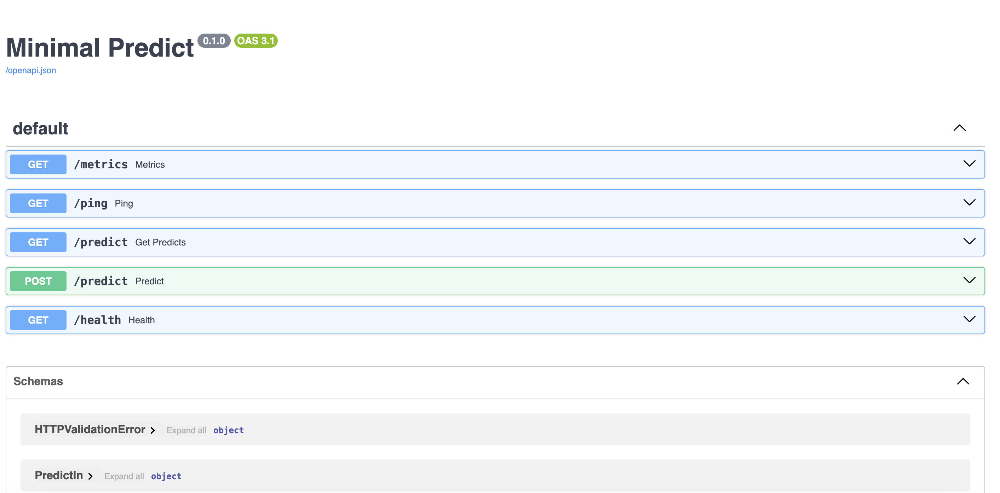
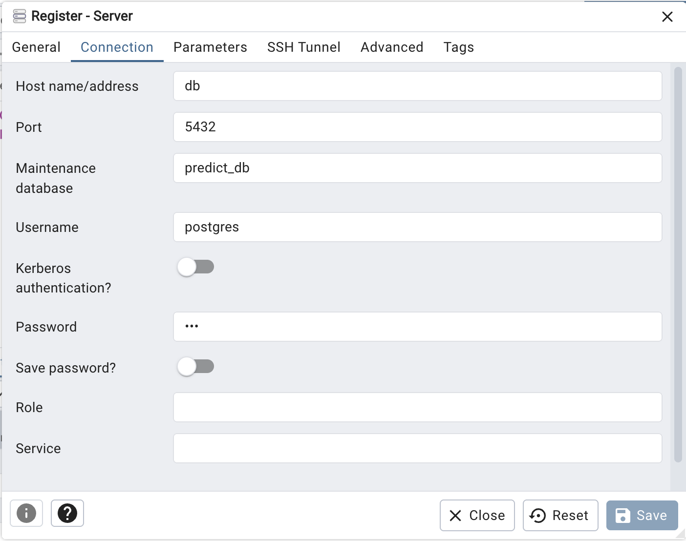
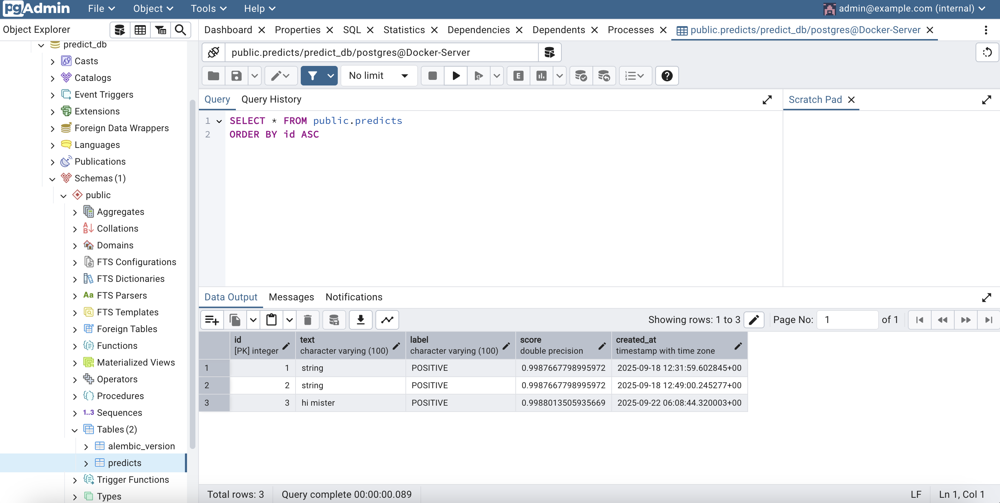
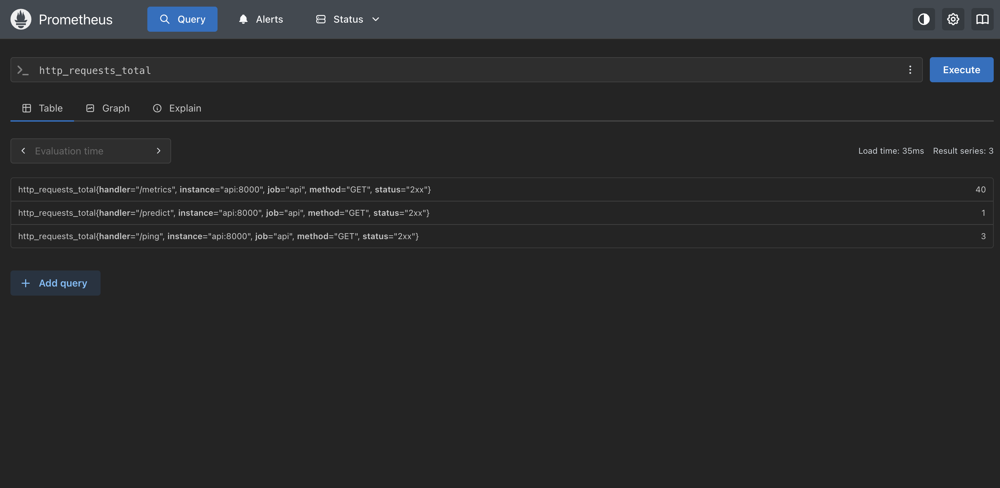
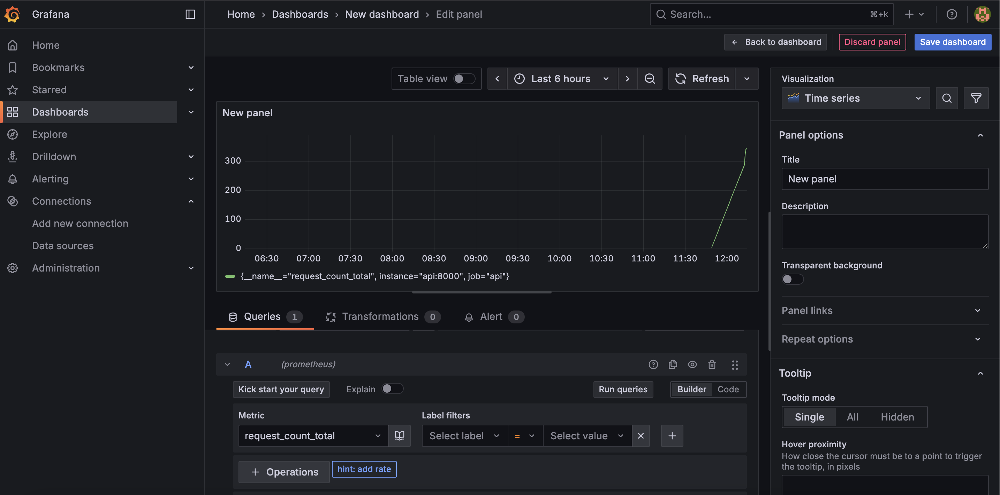

# Инструкции по запуску приложения
### Первый старт (с билдом)
- docker compose up -d --build
### Проверка логов
- docker compose logs -f имя сервиса

### Swagger 
- http://localhost:8000/docs

### pgAdmin 
- http://localhost:5050 логин пароль из .env 
(Добавьте сервер: Host=db, Port=5432, User/Password — как в .env)

### Prometeus
- http://localhost:9090

### Grafana
- http://localhost:3000 (admin, admin по дефолту)

### Миграции БД (alembic)
- docker compose exec api alembic upgrade head

### Стоп без удаления данных
docker compose down
### Полная очистка со всеми томами (включая кэш модели!)
docker compose down -v --remove-orphans